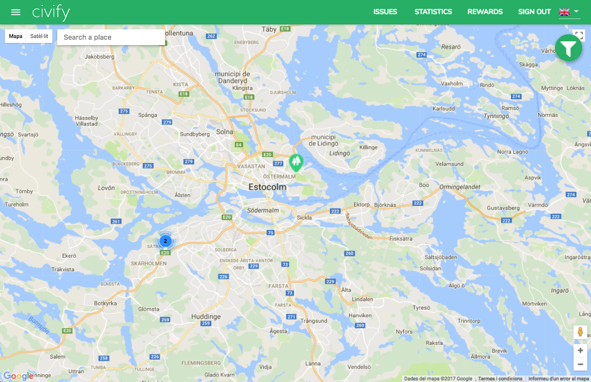
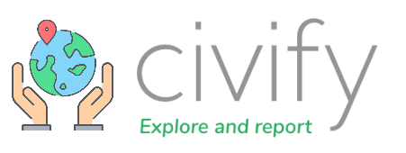
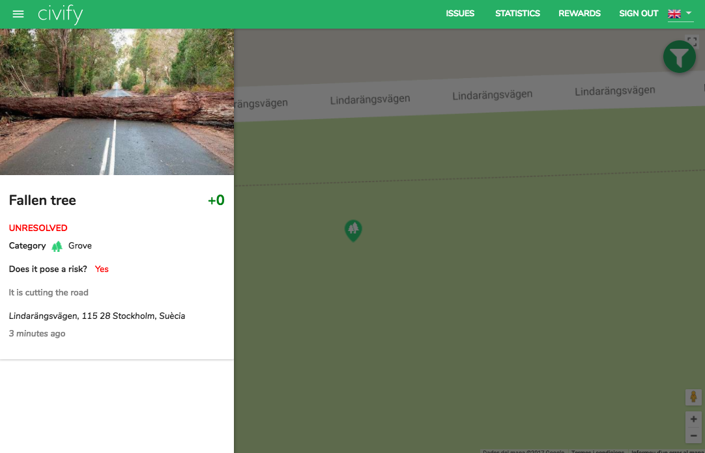
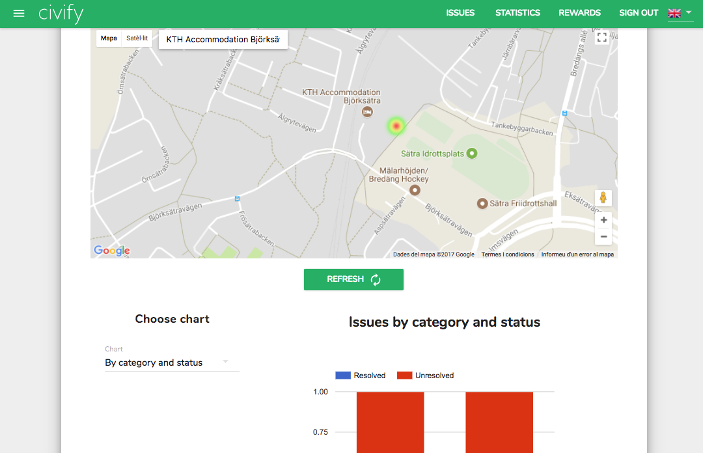
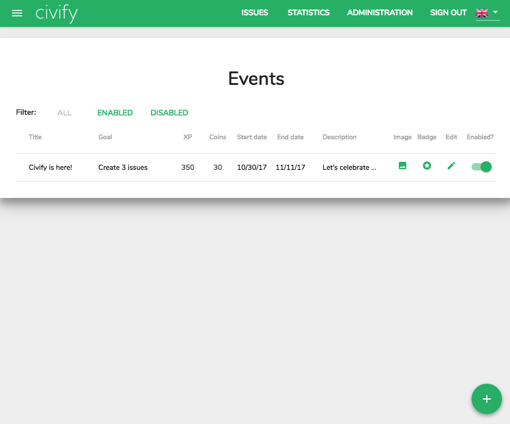
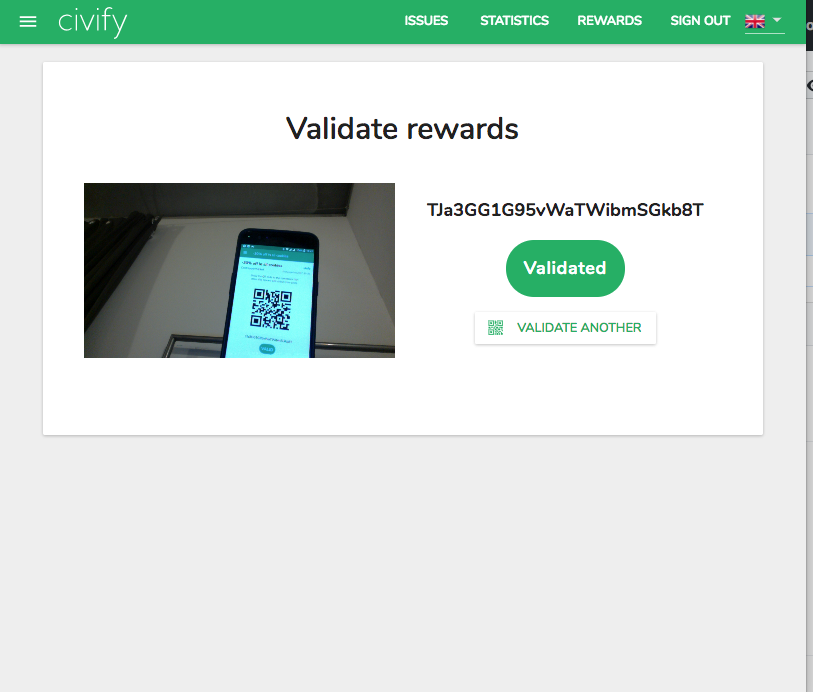
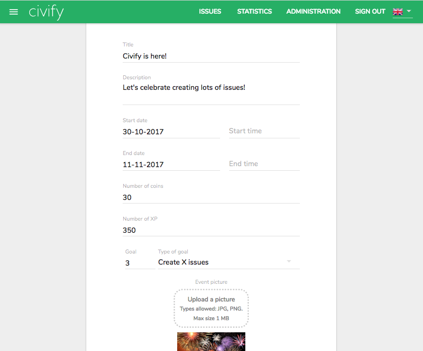

> The user community where you win by caring about your city. Explore your city and warn about the issues in your surroundings. Be actively engaged by supporting other citizens so that your local institutions can resolve them. In addition, you will get rewards for your commitment!

***Civify*** was a group project for [Software Engineering Project](https://www.fib.upc.edu/en/studies/bachelors-degrees/bachelor-degree-informatics-engineering/curriculum/syllabus/PES) at UPC BarcelonaTech - Barcelona School of Informatics done by seven students ([@dsegoviat](https://github.com/dsegoviat), [@sergiosanchis](https://github.com/sergiosanchis), [@IvanDeMingo](https://github.com/IvanDeMingo), [@Alcasser](https://github.com/Alcasser), [@carleslc](https://github.com/carleslc), [@ricardfos](https://github.com/ricardfos) & [@ArnauBlanch](https://github.com/ArnauBlanch)).

# Civify: Web
## Features:
* Issues map (with search, details page & filters)
* Issue statistics page with heatmap and charts by zone
* Administration: achievements and events management
* Login & businesses registration
* Bussiness' rewards management
* Bussiness' rewards validation using computer/smartphone camera & QR codes
* Multi-language support

This web was developed using React, Redux (+ redux-saga), Google Maps API, material-ui. It interacted with the [Civify API](https://github.com/ArnauBlanch/civify-backend) and was linked by the [Civify app](https://github.com/ArnauBlanch/civify-app).

**Screenshots**

   
   
   

---
**API repo:** https://github.com/ArnauBlanch/civify-backend

**App repo:** https://github.com/ArnauBlanch/civify-app

